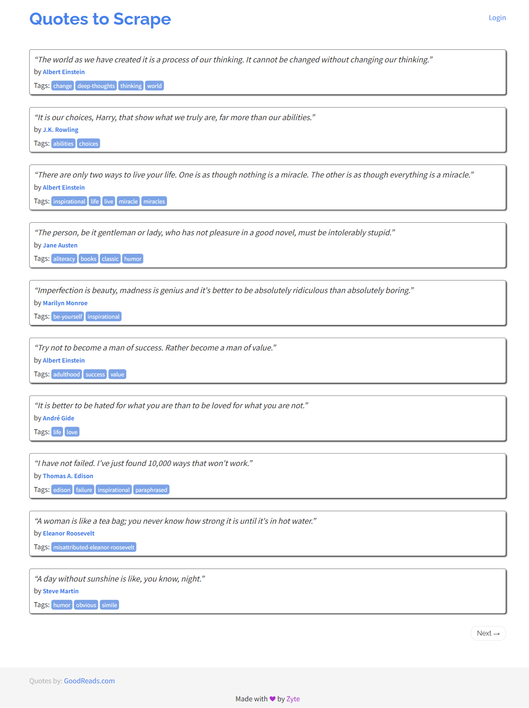

# quotes.toscrape.com (JS) 名言一覧

取得日時: 2026-09-09 08:32:09
収集元: https://quotes.toscrape.com/js
件数: 10

| No | 名言 | 著者 |
| --- | --- | --- |
| 1 | “The world as we have created it is a process of our thinking. It cannot be changed without changing our thinking.” | Albert Einstein |
| 2 | “It is our choices, Harry, that show what we truly are, far more than our abilities.” | J.K. Rowling |
| 3 | “There are only two ways to live your life. One is as though nothing is a miracle. The other is as though everything is a miracle.” | Albert Einstein |
| 4 | “The person, be it gentleman or lady, who has not pleasure in a good novel, must be intolerably stupid.” | Jane Austen |
| 5 | “Imperfection is beauty, madness is genius and it's better to be absolutely ridiculous than absolutely boring.” | Marilyn Monroe |
| 6 | “Try not to become a man of success. Rather become a man of value.” | Albert Einstein |
| 7 | “It is better to be hated for what you are than to be loved for what you are not.” | André Gide |
| 8 | “I have not failed. I've just found 10,000 ways that won't work.” | Thomas A. Edison |
| 9 | “A woman is like a tea bag; you never know how strong it is until it's in hot water.” | Eleanor Roosevelt |
| 10 | “A day without sunshine is like, you know, night.” | Steve Martin |

